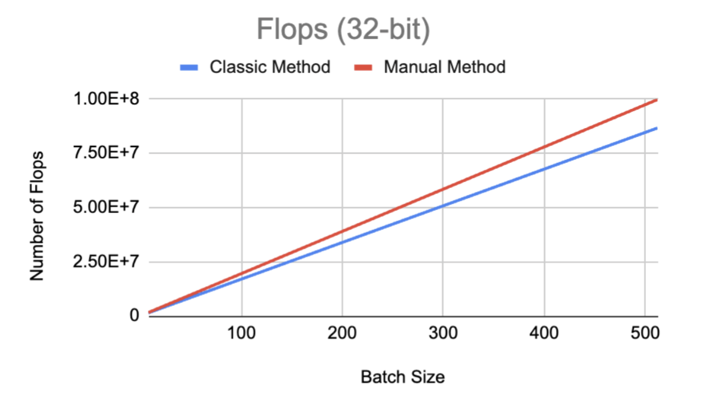
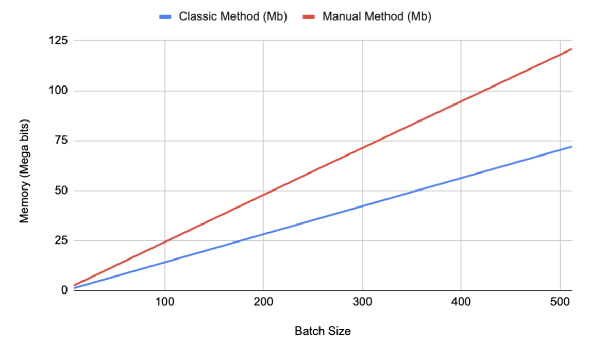

# Performance-Analysis-of-a-CNN-Model

### The purpose of this project is to study the performance of a part of a neural network using the NVIDIA-A100 GPU on NYU's HPC System.

### Mainly, we are focused on discussing the time and memory complexity of a particular convolution layer (Conv2d-2) of MNIST CNN. 

#### Following tasks are performed in the project:

1. We calculate the time complexity (in FLOPs) of the CNN layer using two methods. First is the manual method, where we use Python's “thop” library. This method is needed to serve as a baseline model for comparison. The second method is the usual method, where we create the MNIST model with the CNN layer.
2. We compare the time and space complexity of both methods and visualize them on a graph for different batch sizes.
3. We also discuss the GPU memory utilization for the CNN model with different batch sizes.
4. Lastly, we discuss the CNN model summary for both types of models.

#### Results
1. Time Complexity Comparison of two methods (in FLOPs) for different batch sizes 

2. Space Complexity (Memory) Comparison of the two methods (in Mb) for different batch sizes.

